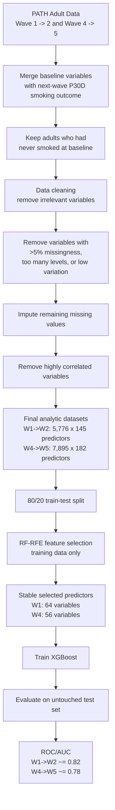

# PATH Paper Reading Notes

## Paper 1 - Smoking Initiation in Adults

**Paper:** *Are the Relevant Risk Factors Being Adequately Captured in Empirical Studies of Smoking Initiation? A Machine Learning Analysis Based on the Population Assessment of Tobacco and Health Study*  
**Citation:** Le et al., *Nicotine & Tobacco Research*, 2023

### Goal

Identify important baseline predictors of cigarette smoking initiation among PATH adults who had never smoked at baseline.

The paper analyzes two longitudinal transitions:

- Wave 1 -> Wave 2
- Wave 4 -> Wave 5

Baseline variables are used to predict next-wave past-30-day cigarette smoking status. The two wave pairs are used to assess whether selected risk factors remain robust over time.

### Pipeline



### RF-RFE Feature Selection

RF-RFE = **Random Forest + Recursive Feature Elimination**.

Purpose:

- Rank candidate predictors using Random Forest variable importance.
- Recursively remove weak predictors.
- Use cross-validation to evaluate candidate feature subsets.
- Repeat the procedure to identify stable predictors.

Random Forest importance is based on mean decrease in accuracy. Conceptually, for predictor \(X_j\):

```text
Importance(X_j)
  ~= Accuracy(original)
     - Accuracy(after permuting X_j)
```

A larger decrease means the model depended more strongly on that predictor.

### Cross-Validation and Class Imbalance

The RF-RFE procedure uses:

- 5-fold cross-validation
- repeated 3 times
- ROSE random oversampling inside cross-validation

Class imbalance:

- Wave 1 -> 2: 197 initiators (3.4%) vs. 5,579 non-initiators
- Wave 4 -> 5: 208 initiators (2.6%) vs. 7,687 non-initiators

Oversampling is performed **only on the training folds**, not on the validation fold.

```text
CV split
  |
  +-- Training folds --> ROSE oversampling --> Train RF
  |
  +-- Validation fold --> keep original class distribution
                                      |
                                      v
                                  Evaluate
```

### Stability Selection

Because RF-RFE is stochastic, the entire feature-selection process is repeated. About 100 simulations were sufficient for the intersection of selected feature subsets to stabilize.

A predictor is retained if it is selected in at least **95% of simulations**.

### Main Result

RF-RFE reduced the baseline variables to:

- 64 predictors for Wave 1 -> Wave 2
- 56 predictors for Wave 4 -> Wave 5

XGBoost using these selected variables achieved approximately:

- AUC = 0.82 for Wave 1 -> Wave 2
- AUC = 0.78 for Wave 4 -> Wave 5

Consistently identified predictors included BMI, dental/oral health, education, employment, financial status, mental/physical health, social influence, and tobacco risk perception.

## Paper 2 - ENDS Use in Adolescents

**Paper:** *Key Risk Factors Associated With Electronic Nicotine Delivery Systems Use Among Adolescents*  
**Citation:** Thuy T. T. Le, *JAMA Network Open*, 2023

### Goal

Identify the most important baseline risk factors associated with future ENDS use among adolescents who were tobacco-naive at baseline.

The study uses:

- PATH Youth Wave 4.5 -> Wave 5
- Wave 4.5 predictors
- Wave 5 past-30-day ENDS use outcome, approximately one year later

### Pipeline Figure

```text
Raw PATH Youth Wave 4.5
   |
   v
Population selection
   |
   +-- tobacco-naive adolescents at baseline
   +-- exclude missing outcomes
   +-- exclude adolescents who aged out of youth questionnaire
   |
   v
Data preprocessing
   |
   +-- remove irrelevant variables
   +-- remove variables with >10 levels, >5% missingness, or low variation
   +-- impute remaining missing values
   +-- remove highly correlated variables
   |
   v
Final baseline predictor set
   |
   +-- 7,943 adolescents
   +-- 219 predictors
   |
   v
80/20 Train-Test Split
   |
   +---- TEST ---------------------------------------------+
   |                                                       |
 TRAIN                                                     |
   |                                                       |
   v                                                       |
Repeated RF-RFE                                            |
   |                                                       |
   +-- 4-fold CV repeated 5 times                          |
   +-- oversampling training folds only                    |
   +-- RF importance                                       |
   +-- recursively eliminate features                      |
   +-- choose subset once accuracy reaches 99% of max      |
   |                                                       |
   v                                                       |
>=95% stable features                                      |
   |                                                       |
   +-- 219 predictors -> 44 selected predictors            |
   |                                                       |
   v                                                       |
XGBoost + Bayesian hyperparameter optimization             |
   |                                                       |
   v                                                       |
                           <----------------------------- TEST
                                |
                                v
                             ROC/AUC
                                |
                                +-- AUC ~= 0.77
                                +-- 95% CI: 0.71-0.82
                                |
                                v
                              SHAP
                                |
                                +-- individual feature contributions
                                +-- aggregate SHAP across participants
                                +-- repeat XGBoost/SHAP 1,000 times
                                |
                                v
                         Risk-factor ranking
```

### RF-RFE

The feature-selection idea is the same as in Paper 1:

```text
Random Forest ranks predictors
  -> weak predictors are recursively removed
  -> cross-validation evaluates candidate feature subsets
  -> repeated runs identify stable features
```

For this paper:

- 4-fold cross-validation repeated 5 times
- oversampling applied only to training folds
- optimal feature subset chosen once classification accuracy reaches 99% of the maximum accuracy
- RF-RFE repeated until the intersection of selected feature subsets stabilizes
- final variables selected in >=95% of simulations

Result:

- 219 predictors -> 44 selected predictors

### XGBoost

XGBoost is trained using the RF-RFE-selected predictors.

Bayesian optimization is used for several hyperparameters:

- learning rate
- maximum tree depth
- minimum child weight
- training-instance subsampling
- column subsampling
- class weight balance

The model is evaluated on the untouched test set.

Final test performance:

- AUC ~= 0.77
- 95% CI: 0.71-0.82

### SHAP Interpretation

After XGBoost is trained, SHAP is used to explain how each selected predictor contributes to model predictions.

For an individual prediction:

```text
f(x) = E[f(X)] + sum(phi_j)
```

where:

- `E[f(X)]` = baseline model prediction
- `phi_j` = SHAP contribution of feature `j`

Interpretation:

- positive SHAP value -> pushes the model toward predicting ENDS use
- negative SHAP value -> pushes the model away from predicting ENDS use

SHAP is first calculated at the individual participant level and then aggregated to obtain a global ranking of predictor importance.

```text
Baseline prediction
        +
Friend influence SHAP
        +
Curiosity SHAP
        +
Household tobacco SHAP
        +
Income SHAP
        +
...
        =
Individual XGBoost prediction
```

### SHAP Beeswarm Notes

The paper uses a SHAP beeswarm plot to show both feature importance and direction.

```text
                     SHAP value

lower predicted risk       higher predicted risk
          <-                       ->
------------------------- 0 -------------------------

Friend offer        * * * ********* *
Friends use EC      * ********* *
Household tobacco      ********
Curiosity              ******
...
```

Interpretation:

- each dot = one participant
- x-axis = that feature's SHAP value for that participant
- left of zero = decreases predicted ENDS use
- right of zero = increases predicted ENDS use
- color = the participant's original feature value

Important coding caution:

- "High feature value" in a SHAP plot should not automatically be interpreted as "high risk."
- The original PATH questionnaire coding determines what high and low values mean.

Examples from the paper:

| Variable | Coding note |
| --- | --- |
| Number of best friends using e-cigarettes | 1 = none, 2 = a few, 3 = some, 4 = most, 5 = all. Higher values indicate more friends using e-cigarettes. |
| Would use ENDS if offered by a best friend | 1 = definitely yes, 2 = probably yes, 3 = probably not, 4 = definitely not. Larger values indicate lower susceptibility. |

### SHAP Stability

The authors did not rely on a single XGBoost run.

```text
Train XGBoost
  -> compute SHAP values
  -> repeat 1,000 times
  -> compute mean SHAP for each risk factor
  -> stable relative ranking of selected predictors
```

The authors chose 1,000 iterations because additional iterations did not substantially change the relative ranking of the selected risk factors.

### Main Results

The most important predictors included:

1. likelihood of using ENDS if offered by a best friend
2. number of best friends using e-cigarettes
3. household tobacco use
4. curiosity about ENDS
5. intention to use ENDS in the next year
6. grade level
7. weekly earnings
8. BMI
9. perceptions of tobacco-product safety
10. parent's English writing proficiency

The main methodological pipeline is:

```text
PATH longitudinal data
  -> preprocessing
  -> RF-RFE stable feature selection
  -> XGBoost prediction
  -> SHAP interpretation and ranking
```
